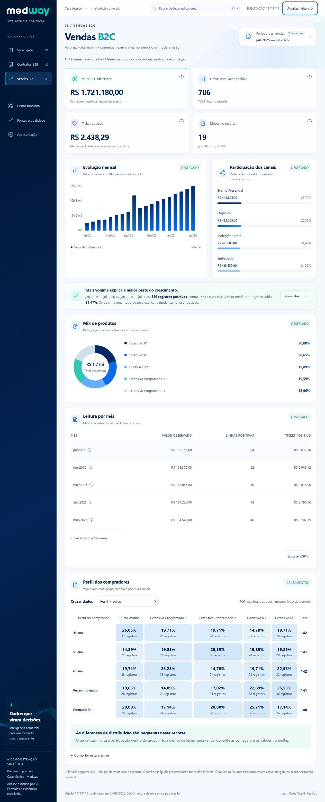

# Medway · Inteligência comercial

Dashboard de vendas B2C, contratos B2B e composição mensal com premissas explícitas. Desenvolvido por Luis para o case técnico de Sales Ops / RevOps, com assistência de IA na análise, implementação e revisão.

**[Abrir o portal do case](https://medway-inteligencia.luisz-braghin.workers.dev/)** · **[Abrir a apresentação completa](https://medway-inteligencia.luisz-braghin.workers.dev/#presentation)**

O portal exige a senha de avaliação, entregue separadamente. Este repositório público é a **edição reproduzível com dados 100% sintéticos**: inclui interface, parsers, fórmulas, DTO e testes de segurança. Não contém dados reais, credenciais, a pesquisa privada da apresentação ou componentes privados de ingestão.



## Executar localmente

Requer Node.js 22 ou superior. A demonstração e os testes usam apenas bibliotecas nativas; não é necessário instalar dependências, configurar banco ou fornecer credenciais.

```sh
git clone https://github.com/luis-braghin/medway-inteligencia-comercial.git
cd medway-inteligencia-comercial
npm test
npm run verify:public
npm start
```

Abra **http://127.0.0.1:4517**. Para alterar a porta: `PORT=4600 npm start` em macOS/Linux; `$env:PORT='4600'; npm start` em PowerShell. O servidor se limita à interface loopback e não serve arquivos fora da allowlist.

## O que explorar

- **Visão geral (inicial):** composição mensal, MRR B2B modelado do último mês do filtro, carteira recorrente, mix B2C e leitura mensal com os componentes separados.
- **Contratos B2B:** status atual, licenças, plano e região; valor mensal em BRL da demonstração.
- **Vendas B2C:** saldo observado, linhas positivas, ticket positivo, evolução mensal, canais, produtos e CSV do recorte. Sete cruzamentos mostram perfil × curso/canal, canal × curso, embaixador × perfil/curso e evento × perfil/região × curso, com bases e tooltips no mesmo período. Sete cruzamentos mostram perfil × curso/canal, canal × curso, embaixador × perfil/curso e evento × perfil/região × curso, com bases e tooltips no mesmo período. Sete cruzamentos mostram perfil × curso/canal, canal × curso, embaixador × perfil/curso e evento × perfil/região × curso, com bases e tooltips no mesmo período.
- **Fontes e qualidade:** hashes sintéticos, versões, advertências e definições dos indicadores.
- **Apresentação pública:** cinco slides explicando a solução, sem os resultados privados. A apresentação completa está no portal.

O seletor de período oferece atalhos de anos com cobertura explícita e um intervalo personalizado de meses inclusivos. A seleção é um rascunho até aplicar; cancelar mantém o período anterior e limpar volta à base completa. Indicadores, rankings, gráficos, tabelas e CSV compartilham o recorte. A comparação usa os mesmos meses do ano anterior quando disponíveis; a carteira B2B mantém o snapshot.

A rosca, as barras de composição e a leitura mensal oferecem detalhes por mouse, teclado e toque. O MRR modelado usa BRL definido na demonstração e status atual; sua evolução não reconstrói status histórico nem recebimentos.

Use o filtro de período, consulte as definições dos cartões e navegue pela busca com `Ctrl K`. Tabelas largas têm rolagem horizontal. A apresentação admite setas, Home, End e Esc.

As matrizes descrevem compras positivas, com denominador de cada grupo. Elas não medem conversão ou eficiência: isso exige leads, exposição e custos. O artefato analítico exige a mesma versão e hash da fonte; uma publicação diferente pede recálculo. Regerar a matriz sintética: `node scripts/build-segments.mjs`.

## Estrutura e validação

| Área | Implementação |
| --- | --- |
| Fontes fictícias determinísticas | `src/demo-data.mjs` |
| Parsing, normalização e qualidade | `src/normalize.mjs` |
| Fórmulas e projeções em centavos inteiros | `src/views.mjs` |
| Resposta agregada por allowlist | `src/dashboard-dto.mjs` |
| Interface responsiva | `dashboard/dist/` |
| Demo HTTP local | `src/demo-server.mjs` |
| Código do portal protegido e cliente RPC | `src/hosted-app.mjs`, `src/portal-client.mjs` |
| Regressões, fórmulas, contratos e segurança | `tests/` |

Os testes usam entradas sintéticas e serviços simulados. Exercitam exatidão monetária, preservação de negativos/zero, snapshots incompletos, versão inconsistente, exclusão de campos privados, acesso sem sessão, identidade do gateway, logout, CSRF, limites de corpo e timeout. Os testes de portal não contatam Cloudflare ou Supabase.

Consulte [arquitetura e limites](docs/ARCHITECTURE.md), [segurança](docs/SECURITY.md) e [guia da entrega](docs/DELIVERY.md).

## Limites analíticos

Uma linha positiva não comprova cliente único, venda única, pagamento ou margem. O snapshot B2B não reconstrói vigência nem churn histórico; seu campo mensal não é homologado como MRR. O cenário assume BRL, status atual, coexistência e mês cheio desde o início do contrato. Datas de captura e publicação não comprovam atualização factual da fonte.

Os resultados sintéticos permitem avaliar código e interação; não sustentam conclusões comerciais sobre a Medway. Marcas mencionadas pertencem a seus titulares. A presença pública do código não concede licença sobre dados ou componentes privados excluídos.
