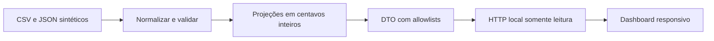

# Arquitetura

`syntheticSources()` gera uma base determinística de 19 meses e oito contratos. Os parsers processam o mesmo contrato de entrada utilizado pelo case. `buildViews()` agrega com `BigInt`, preserva a razão do ticket e separa observado de modelado. `toDashboardDTO()` reconstrói a resposta por allowlists, sem registros brutos nem identidades institucionais.

O servidor demo mantém a resposta em memória e atende apenas leitura e arquivos estáticos explicitamente autorizados. Não há coleta, agendamento, persistência, atualização remota ou autenticação nesta demonstração local. Ela não deve ser confundida com o backend privado do portal hospedado.

## Portal protegido

O código `hosted-app.mjs` mostra o tratamento de login, cookies opacos, sessões revogáveis, proteção de origem, respostas limitadas e ativos autenticados. `portal-client.mjs` restringe chamadas a cinco RPCs e fixa um projeto Supabase. A referência de projeto publicada é fictícia e deve ser substituída em uma implantação própria, junto com as configurações privadas do backend.

Os testes simulam Auth e RPC; executar `npm start` não instala esse backend. As RPCs exigidas são declaradas em `PORTAL_RPC_ALLOWLIST` no cliente. Sua instalação, o schema de sessões, a identidade dedicada do gateway e as políticas de acesso fazem parte da infraestrutura privada e não são fornecidos nesta edição.

A ingestão real consome componentes canônicos privados para snapshots e publicação. Eles não são distribuídos, copiados ou substituídos por um suposto equivalente neste repositório. A reprodução pública cobre parsing, cálculo, DTO, interface e contratos do portal; não reproduz integralmente a infraestrutura privada.
